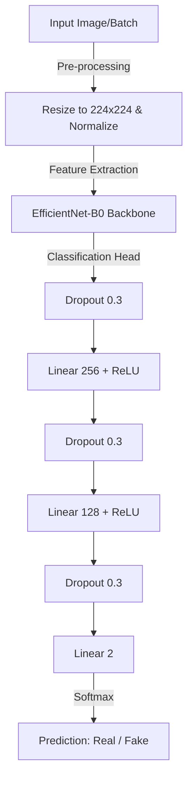

# Deepfake Detection System

A machine learning pipeline for deepfake detection utilizing EfficientNet-B0 and PyTorch.


## Project Overview

This project provides a robust machine learning pipeline for detecting deepfake images using a pre-trained EfficientNet-B0 backbone. It processes image datasets to classify samples as either genuine or manipulated via a custom multi-layer perceptron classifier head. The system supports full end-to-end functionality including custom model training, batch inference, and dataset statistical evaluation. It is designed as a standalone Python CLI tool, enabling researchers and engineers to programmatically evaluate manipulated facial content with high efficiency.

## Architecture Diagram



## Key Features

*   **Deepfake Classification Model** — Transfer learning implementation using an EfficientNet-B0 backbone adapted for binary classification of authentic vs. manipulated images.
*   **Custom Classifier Head** — 3-layer feed-forward neural network attached to the CNN feature extractor, utilizing heavy dropout (0.3) layers to prevent overfitting.
*   **End-to-end CLI Pipeline** — Unified entry point (`deepfake_system.py`) supporting independent commands for model training (`--mode train`), inference (`--mode predict`), and statistical evaluation (`--mode evaluate`).
*   **Dynamic Dataset Handling** — Custom PyTorch `Dataset` loader featuring on-the-fly image transformations, including random rotation, horizontal flipping, and color jittering.

## Tech Stack

| Category | Technology |
|---|---|
| Language | Python 3.8+ |
| Deep Learning | PyTorch, Torchvision |
| Image Processing | OpenCV, Pillow |
| Data Manipulation | NumPy, Pandas |
| Progress Tracking | tqdm |
| CLI Parsing | argparse |

## Project Structure

```
.
├── deepfake_system.py  # Core ML pipeline (Train, Predict, Evaluate)
├── requirements.txt    # Python dependencies
├── data/               # Local dataset directory
│   ├── Dataset/        # Root for images (Train/Validation/Test splits)
│   ├── real_videos/    # Raw authentic video samples (legacy folder)
│   └── fake_videos/    # Raw manipulated video samples (legacy folder)
├── models/             # Serialized PyTorch model weights (.pth)
│   └── real_data_model.pth # Pre-trained model state dict
├── results/            # Output visualization and metrics
└── venv/               # Virtual environment (ignored in git)
```

## API Reference

| Method | Endpoint | Description | Auth Required |
|--------|----------|-------------|---------------|
| N/A | N/A | No REST API exposed; functionality is provided via CLI | N/A |

*Note: Since there is no API backend in this repository, here is the equivalent CLI Reference:*

| Command | Argument | Description | Required |
|---------|----------|-------------|----------|
| python | `--mode` | Execution mode: `predict`, `evaluate`, or `train` | No (default: `predict`) |
| python | `--model` | Select model from `Config.MODELS` (e.g., `real_data`) | No |
| python | `--image` | Path to image file for prediction | Yes (if `predict` mode) |
| python | `--dataset` | Directory path for dataset evaluation | No |
| python | `--split` | Dataset split for evaluation (`Train`, `Test`, `Validation`) | No |

## Database Schema

| Table | Key Columns | Relationships |
|---|---|---|
| N/A | N/A | No database is utilized; data is loaded directly from the filesystem (`data/Dataset/`) |

## ML Pipeline

*   **Task Definition:** Binary Image Classification (Real vs. Fake)
*   **Input Features:** 224x224x3 RGB image tensors normalized to ImageNet statistics
*   **Models Evaluated:** EfficientNet-B0 (backbone) with a custom Multi-Layer Perceptron head
*   **Evaluation Metrics Used:** Accuracy (Overall, Real, Fake), CrossEntropy Loss, Confidence Scores
*   **Results:**

| Model | Configuration | Batch Size | Optimizer | Output |
|-------|---------------|------------|-----------|--------|
| EfficientNet-B0 | Pretrained Backbone + MLP Head | 16 | Adam (lr=1e-4) | `real_data_model.pth` |

## Environment Variables

| Variable | Description | Example |
|----------|-------------|---------|
| N/A | No environment variables required; configuration is hardcoded in `Config` class | N/A |

## Getting Started

### Prerequisites
*   Python 3.8 or higher
*   NVIDIA GPU with CUDA support (optional but highly recommended)

### Installation

```bash
git clone https://github.com/Abhishek-Pandey786/deepfake-detection.git
cd deepfake-detection

# Create a virtual environment
python -m venv venv
venv\Scripts\activate  # On Windows

# Install dependencies
pip install -r requirements.txt
```

### Running locally

To run inference on a single image:
```bash
python deepfake_system.py --mode predict --image path/to/your/image.jpg
```

To run the training pipeline:
```bash
python deepfake_system.py --mode train
```

## Screenshots / Demo


## Known Limitations

*   **Image-only processing:** The system processes static images only; video processing requires an external frame-extraction pipeline.
*   **No integrated face cropping:** Face detection is not explicitly enforced before classification; the model assumes the provided image already contains a cropped face.
*   **Hardcoded configurations:** Configurations are hardcoded inside the `Config` class in `deepfake_system.py`, limiting runtime flexibility without modifying source code.
*   **No REST API:** The project does not expose a Web UI or REST endpoints, relying entirely on local command-line execution.

## Future Improvements

*   Refactor the configuration from `Config` class to a `.env` or `config.yaml` file for better parameter flexibility.
*   Implement a FastAPI backend to serve model predictions over HTTP.
*   Integrate an MTCNN or RetinaFace pipeline to automatically extract faces from raw images and videos prior to classification.
*   Dockerize the application to ensure consistent environments and ease of deployment across different servers.

## Author

Abhishek Pandey
